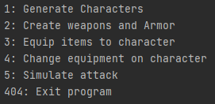
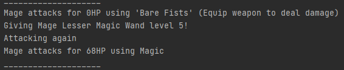
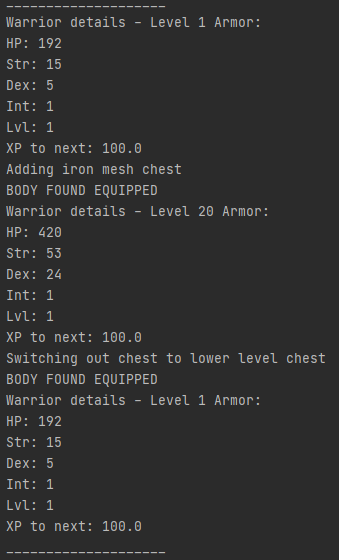

# Text based RPG game character creation

This is assignment 2 for the Experis Academy.

For this assignment we were handed a fairly extensive project description.  
This description stated the stats for characters, weapons and armor as well as how these should scale base on leveling.  
Main goal was to test our design and modeling skills using *design patterns* like ***Strategy***, ***Factory*** or ***Builder***.  
The use of design patters was not a requirement, but strongly suggested for easier development.  

###When first starting the program
When starting the program you are greeted with 6 options:

All of these choices have been pre-programmed to run.  
This means that the only control the user has is which option to run first.  

Below here I've added some images from the outputs:

  

Please feel free to fork or download the repo for your own testing.